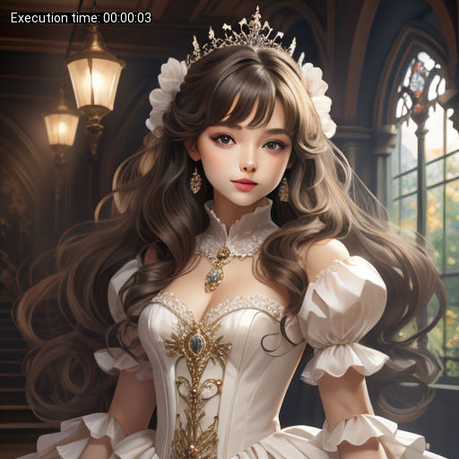
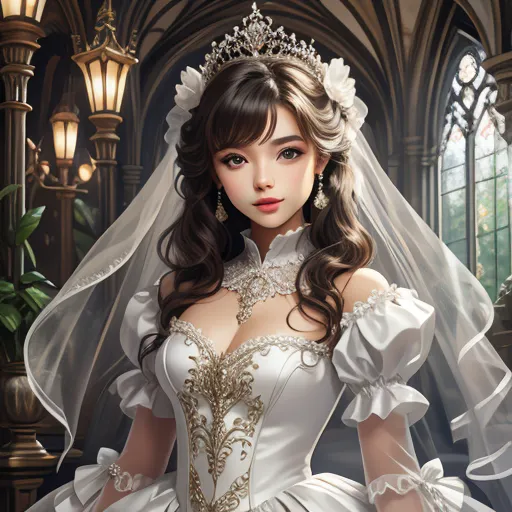
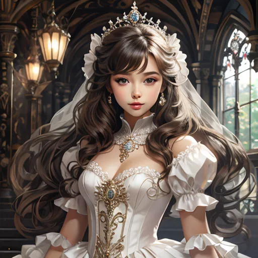
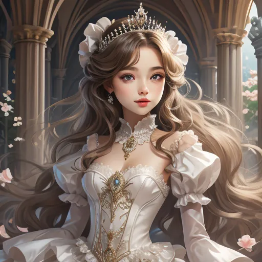
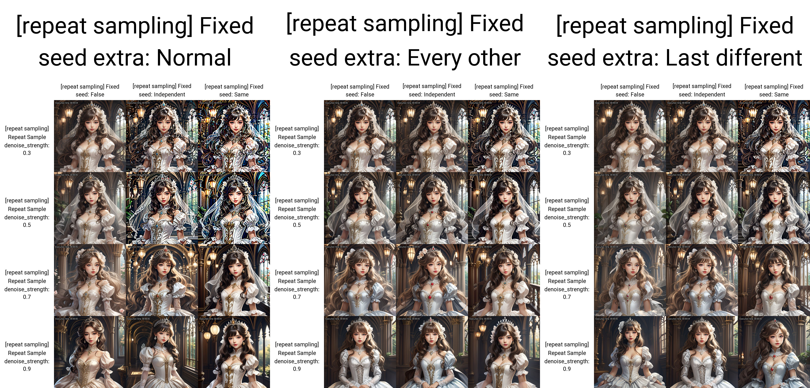
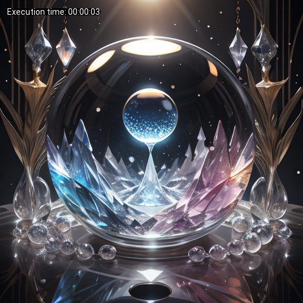
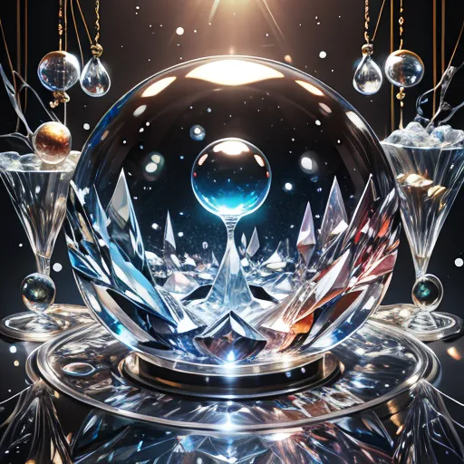
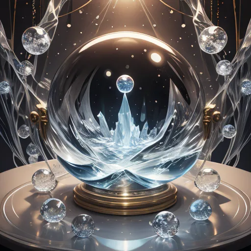
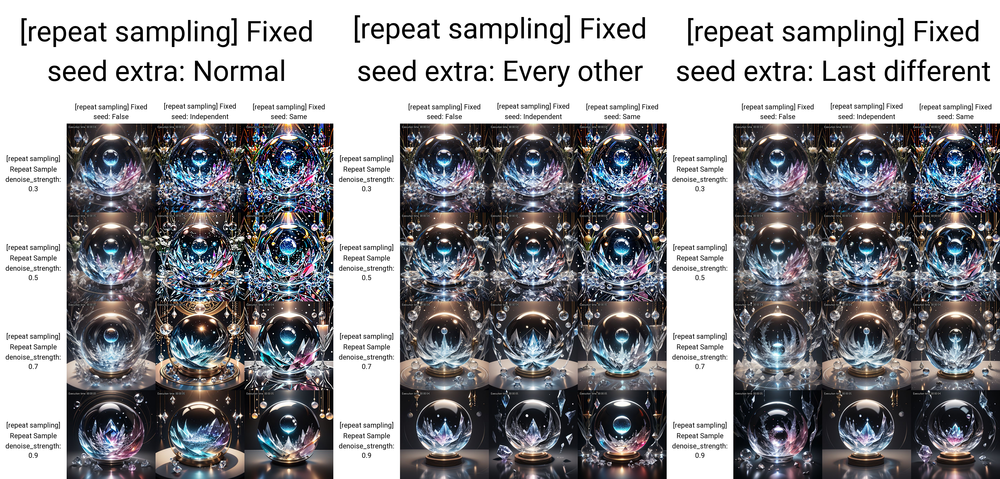

# Stable Diffusion Web UI Plugin: Repeated Sampling Script

This plugin for Stable Diffusion Web UI introduces an advanced feature for image generation through repeated sampling.
Inspired by the repeat sampler and the way hires fix improves image details even at 1x upscaling.

Does not increase the time or steps it takes to generate an image.

## Features

- **Repeat Sampling**: Generates images by iterating the sampling process several times, potentially enhancing image quality.
- **Denoising Strength Control**: Adjust the denoising strength through a slider.
- **Repeat Control**: Define the number of times the sampling should be repeated.
- **Fixed Seed Options**: Maintain consistent results across sampling iterations with different seed options:
  - `False`: Random seeds.
  - `Independent`: Independent but fixed seeds across repeats.
  - `Same`: The same seed used for all repeats.
- **Fixed Seed Extra Options**: Maintain consistent results across sampling iterations with different seed options:
  - `Normal`: Nothing special.
  - `Every other`: For random seeds, changes seed only every second repeat. Else switches between 2 fixed seeds every step.
  - `Last different`: The same seed used for all repeats, but the last is forced to be different
- **Sampling Tactic**: Choose between keeping denoising strength 'Equal' across repeats or 'Decreasing' it successively.
  
## Usage

To use this script, enable the "Repeat enabled" checkbox and configure the parameters as desired in the accompanying interface within the Web UI.

## Configuration Options

- `Denoising Strength`: Sets the denoising strength for the sampling process.
- `Repeats`: Specifies the number of repetitions for the sampling.
- `Fix RNG`: Sets the random number generation mode for consistent sampling.
- `Fix RNG Extra`: Sets extra options for random generation.
- `Sampling Method`: Offers a selection of different sampling techniques from which you can choose.

## Example Images
### Repeat Sampling disabled:

### Repeat Sampling enabled:

### Repeat Sampling disabled:

### Repeat Sampling enabled:

## Installation

To install the script, clone this repository either via the webui or directly into the extension folder

## Contributing
If you'd like to contribute to the development of this plugin, please create an issue or pull request on the GitHub repository.

## Acknowledgments
Neutral prompt for the layout of the extension structure

